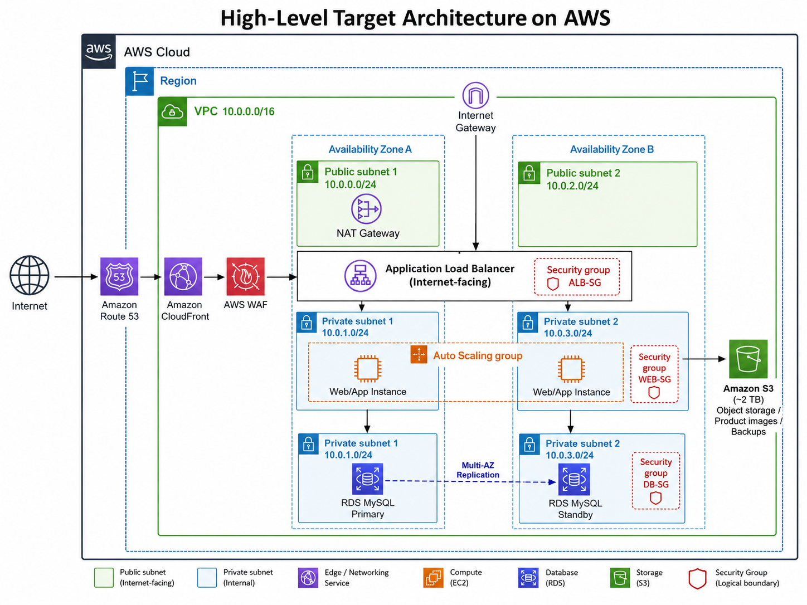

# AWS Cloud Practitioner - Migration Project

This project presents a high-level AWS migration strategy for moving an on-premises three-tier e-commerce application to AWS.

## Proposed AWS Services

- Amazon VPC - isolated cloud network
- Amazon EC2 - application hosting
- Application Load Balancer - traffic distribution
- EC2 Auto Scaling - automatic scaling
- Amazon RDS for MySQL Multi-AZ - managed database and failover
- Amazon S3 - scalable object storage
- Amazon EBS - EC2 block storage
- Amazon CloudFront - content delivery
- Amazon Route 53 - DNS
- AWS WAF and Security Groups - security
- Amazon CloudWatch and AWS CloudTrail - monitoring and auditing

## Estimated Cost

Approximately **CAD $1,000-$3,000 per month**, depending on traffic, compute capacity, storage, backups, and data transfer.

## Architecture

## Key Learning

This project helped me understand how AWS services work together to build a scalable, highly available, secure, and cost-conscious cloud architecture.

## Course

Amazon AWS I - Cloud Practitioner

Special thanks to professors **Ali and David** for their guidance and support.
